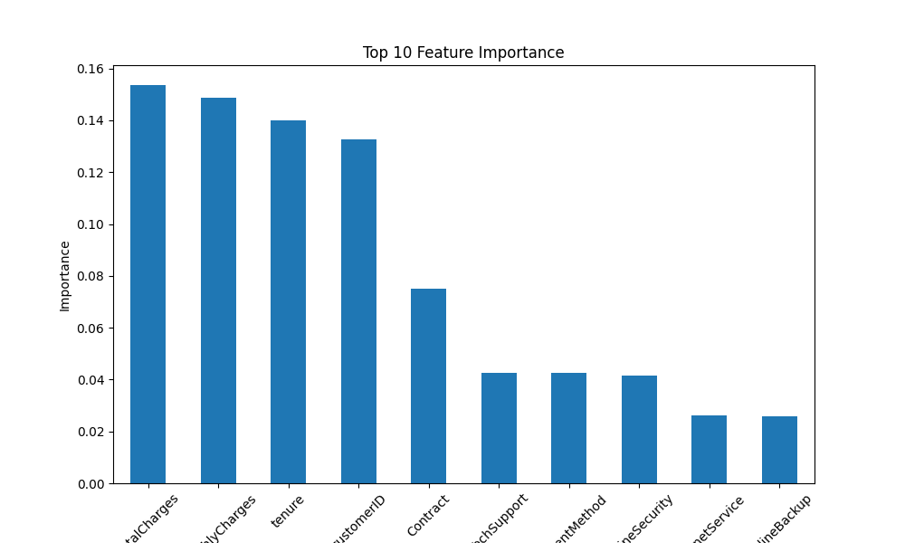
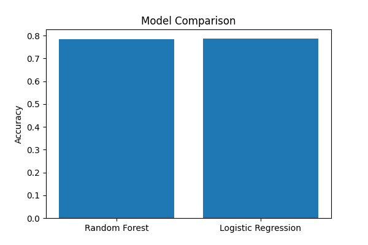
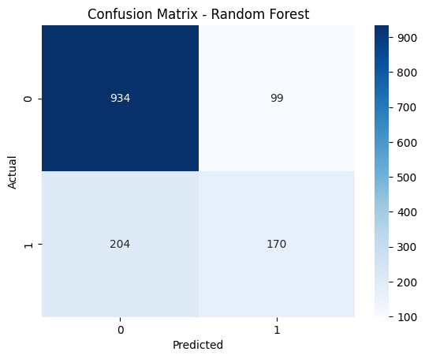

# 📊 Customer Churn Analysis and Prediction

## 🧠 Overview
This project focuses on analyzing customer churn in a telecommunications company and building a machine learning model to predict whether a customer is likely to leave.

The goal is to help businesses identify at-risk customers and take proactive measures to improve customer retention.

---

## 🎯 Objectives
- Perform data preprocessing  
- Identify key factors influencing churn  
- Train machine learning models  
- Evaluate model performance  
- Provide business insights and recommendations  

---

## 🧩 Tasks Implemented
✔ Task 1: Data Preparation  
✔ Task 2: Train-Test Split  
✔ Task 3: Feature Selection  
✔ Task 4: Model Selection  
✔ Task 5: Model Training  
✔ Task 6: Model Evaluation  

---

## ⚙️ Technologies Used
- Python 🐍  
- Pandas  
- NumPy  
- Scikit-learn  
- Seaborn  
- Matplotlib  

---

## 🤖 Models Used
- Random Forest Classifier 🌲  
- Logistic Regression 📈  

---

## 📈 Evaluation Metrics
- Accuracy  
- Precision  
- Recall  
- F1-score  
- ROC-AUC  

---

## 📊 Model Visualization

### 🔍 Feature Importance


---

### 📊 Model Comparison


---

### 🔲 Confusion Matrix (Random Forest)


---

## 📊 Results
- Random Forest performed better than Logistic Regression  
- Achieved strong prediction accuracy  
- Visualization helped in understanding model performance clearly  

---

## 💡 Business Insights
- Customers with higher monthly charges are more likely to churn  
- Customers with longer tenure are less likely to churn  
- Month-to-month contract users have higher churn rates  

---

## 🚀 Recommendations
- Offer discounts to high-risk customers  
- Encourage long-term contracts  
- Improve customer engagement strategies  

---

## 📂 Project Structure

```
Customer-Churn-Prediction/
│
├── Customer_Churn_Analysis_and_Prediction.ipynb
├── README.md
├── requirements.txt
├── Telco_Customer_Churn_Dataset.csv
├── images/
│   ├── confusion_matrix_rf.png
│   ├── feature_importance.png
│   └── model_comparison.png
```

---

## ▶️ How to Run

```bash
# Clone the repository
git clone https://github.com/Prasanna9360/Customer-Churn-Prediction.git

# Navigate to the project folder
cd Customer-Churn-Prediction

# Install dependencies
pip install -r requirements.txt

# Run the notebook
jupyter notebook
```

---

## 👨‍💻 Author
**Prasanna G**  
B.Tech Artificial Intelligence and Data Science  

---

## 🔗 Connect with Me
- GitHub: https://github.com/Prasanna9360  
- LinkedIn: https://www.linkedin.com/in/prasanna-g-867b2b2a3/  

---

## ⭐ Acknowledgment
This project was developed as part of a Machine Learning Internship at **SaiKet Systems**.
